  

  
  
  
  
  
  
  
  
  
  
  

  

  

  

  

  <picture>
    <source media="(prefers-color-scheme: dark)" srcset="https://raw.githubusercontent.com/anxiangsir/anxiangsir/output/github-contribution-grid-snake-dark.svg">
    <source media="(prefers-color-scheme: light)" srcset="https://raw.githubusercontent.com/anxiangsir/anxiangsir/output/github-contribution-grid-snake.svg">
    
  </picture>

  

