  

  
  
  
  
  
  
  
  
  
  
  

  <picture>
    <source media="(prefers-color-scheme: dark) and (max-width: 700px)" srcset="assets/github-dashboard-dark-mobile.svg">
    <source media="(prefers-color-scheme: light) and (max-width: 700px)" srcset="assets/github-dashboard-light-mobile.svg">
    <source media="(prefers-color-scheme: dark)" srcset="assets/github-dashboard-dark.svg">
    <source media="(prefers-color-scheme: light)" srcset="assets/github-dashboard-light.svg">
    
  </picture>

